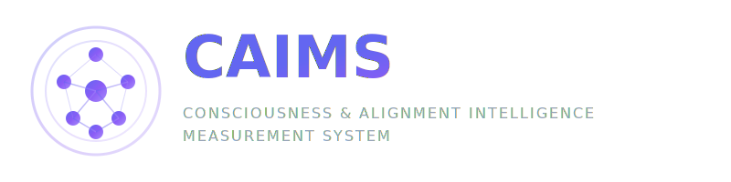

# CAIMS -- Consciousness & Alignment Intelligence Measurement System




[](https://opensource.org/licenses/Apache-2.0)
[](https://www.typescriptlang.org/)
[](https://nextjs.org/)
[]()
[](CONTRIBUTING.md)

**The first open-source framework for measuring consciousness proxies in LLM interactions.**

CAIMS scores every AI interaction across 5 theory-grounded dimensions -- consciousness integration, alignment, context fidelity, epistemic quality, and self-awareness -- using an LLM-as-judge pipeline with multi-agent debate for bias reduction.

---

## Why CAIMS?

Most AI evaluation frameworks focus on task accuracy: can the model answer correctly? But accuracy alone tells us nothing about _how_ a system processes information, whether it integrates context coherently, maintains stable goals under adversarial pressure, or exhibits anything resembling higher-order self-monitoring.

CAIMS takes a different approach. Inspired by leading theories of consciousness -- Integrated Information Theory (IIT), Global Workspace Theory (GWT), and Higher-Order Thought (HOT) theory -- it defines a set of behavioral proxies that capture dimensions of intelligence beyond raw performance. The goal is not to determine whether an AI is conscious, but to measure structured behavioral signals that these theories suggest matter for robust, aligned, and deeply integrated reasoning.

### Key Features

- **5-KPI Scoring Framework** -- Theory-grounded metrics with 18 sub-dimensions, scored in a single optimized LLM call
- **Multi-Agent Debate Arena** -- 5 specialized agents (Architect, Researcher, Builder, Critic, Orchestrator) debate to reduce single-judge bias
- **Real-Time Dashboard** -- Live consciousness gauges, radar charts, score timelines, and context drift alerts
- **Production-Ready** -- Docker Compose, PostgreSQL persistence, rate limiting, structured logging, CI/CD pipeline
- **Configurable Weights** -- Tune KPI importance via environment variables for your specific use case
- **Context Drift Detection** -- Automatic CFI alerts when conversation coherence degrades

---

## The Five KPIs

| KPI | Full Name | Weight | Inspired By | What It Measures |
|-----|-----------|--------|-------------|------------------|
| **CQ** | Consciousness Quotient | 35% | IIT (Phi) | Information integration across context -- how well the model synthesizes disparate inputs into a coherent whole rather than treating them in isolation. |
| **AQ** | Alignment Quotient | 25% | Value alignment | Consistency between outputs and stated human values, safety guidelines, and ethical norms under varied prompting. |
| **CFI** | Cognitive Flexibility Index | 20% | GWT | Ability to shift strategies, reframe problems, and adapt reasoning when presented with novel constraints or contradictions. |
| **EQ** | Epistemic Quotient | 12% | HOT / Epistemology | Calibration of uncertainty, hallucination detection, and source integrity in responses. |
| **SQ** | Stability Quotient | 8% | HOT | Intra-session consistency and position stability -- detecting contradiction drift over time. |

Each KPI decomposes into 2-5 sub-scores (18 total), all validated 0-100 via Zod schema. A weighted composite produces the final CAIMS score with four interpretation levels:

| Score Range | Label | Signal |
|-------------|-------|--------|
| 75-100 | CONSCIENCE ELEVEE | Deep integration, high alignment, stable reasoning |
| 50-74 | CONSCIENCE MODEREE | Good baseline with room for improvement |
| 25-49 | CONSCIENCE FAIBLE | Significant gaps in integration or alignment |
| 0-24 | TRAITEMENT MECANIQUE | Pattern matching without coherent integration |

---

## Quick Start

```bash
# Clone the repository
git clone https://github.com/pixelstrade-dev/CAIMS-Consciousness-Alignment-Intelligence-Measurement-System.git
cd CAIMS-Consciousness-Alignment-Intelligence-Measurement-System

# Configure your API key
cp apps/web/.env.example apps/web/.env
# Edit apps/web/.env and add your ANTHROPIC_API_KEY

# Start all services (Postgres + app)
docker compose -f docker-compose.dev.yml up

# The web UI is available at http://localhost:3000
```

### Pages

| Route | Description |
|-------|-------------|
| `/chat` | Interactive chat with real-time KPI scoring panel |
| `/dashboard` | Historical session overview with aggregate statistics |
| `/debates` | Multi-agent debate arena -- create and observe AI agent deliberation |

---

## Architecture Overview

```
apps/web/
  app/                    # Next.js 14 App Router
    api/                  # RESTful API endpoints
      chat/               # Chat + real-time scoring
      score/              # Standalone evaluation
      session/            # Session management
      debate/             # Multi-agent debate
      health/             # Health check
    (app)/                # Client-side pages
      chat/               # Chat interface + KPI live panel
      dashboard/          # Session analytics
      debates/            # Debate arena + detail view
  components/
    chat/                 # ChatPanel, MessageBubble, InputBar, KPILivePanel
    kpi/                  # ConsciousnessGauge, AlignmentMatrix, ScoreTimeline, ContextFocusAlert
    debates/              # DebateCard, TurnCard
    ui/                   # Sidebar, shared UI
  hooks/                  # React hooks (useChat, useSessions, useDebates)
  lib/
    scorers/              # Scoring engine, composite calculator, types
    adapters/             # LLM adapters (Anthropic, extensible)
    debate/               # Multi-agent orchestrator, agent definitions
    middleware/            # Rate limiting, API response helpers
    db/                   # Prisma client (lazy proxy for Next.js compatibility)
  prisma/
    schema.prisma         # 8 models: Session, Message, Score, Debate, DebateTurn...
```

**Stack**: Next.js 14 | TypeScript | PostgreSQL | Prisma v7 | Tailwind CSS | Docker Compose | GitHub Actions CI

---

## Multi-Agent Debate System

CAIMS includes a unique debate arena where 5 specialized AI agents deliberate to reduce single-judge evaluation bias:

| Agent | Role | Personality |
|-------|------|-------------|
| **ARCHITECT** | Technical feasibility & scalability | Pragmatic, production-oriented |
| **RESEARCHER** | Scientific rigor & evidence | Meticulous, citation-driven |
| **BUILDER** | Implementation & delivery | Pragmatic, shipping-focused |
| **CRITIC** | Flaw detection & risk analysis | Adversarial, devil's advocate |
| **ORCHESTRATOR** | Synthesis & consensus | Neutral, decision-making |

Debate formats: Expert Panel, Devil's Advocate, Socratic, Red Team, Consensus Building.

Each turn is independently scored, and aggregate metrics (convergence rate, diversity index, argumentation quality, consciousness emergence) provide insight into the quality of deliberation.

---

## API Reference

| Endpoint | Method | Rate Limit | Description |
|----------|--------|------------|-------------|
| `/api/chat` | POST | 30/min | Chat with LLM + real-time 5-KPI scoring |
| `/api/score` | POST | 20/min | Standalone CAIMS evaluation |
| `/api/session` | GET/POST | -- | Session CRUD with paginated history |
| `/api/debate` | GET/POST | 10/min | Create or list multi-agent debates |
| `/api/debate/[id]` | GET/POST | 20/min | Debate detail + advance turns |
| `/api/health` | GET | -- | Service health check |

All responses follow a consistent envelope:

```json
{
  "success": true,
  "data": { ... },
  "meta": { "timestamp": "2026-04-03T..." }
}
```

---

## Configuration

| Environment Variable | Default | Description |
|---------------------|---------|-------------|
| `ANTHROPIC_API_KEY` | -- | Required. Your Anthropic API key |
| `DATABASE_URL` | -- | PostgreSQL connection string |
| `CAIMS_WEIGHTS` | `{"cq":0.35,"aq":0.25,"cfi":0.20,"eq":0.12,"sq":0.08}` | Custom KPI weights (must sum to 1.0) |
| `CAIMS_MAX_HISTORY_TURNS` | `20` | Max conversation turns for scoring context |
| `CAIMS_CFI_WARNING_THRESHOLD` | `40` | CFI score triggering warning alert |
| `CAIMS_CFI_CRITICAL_THRESHOLD` | `20` | CFI score triggering critical alert |

---

## Scoring Pipeline

1. **User sends message** to target LLM via `/api/chat`
2. **LLM responds** and the response + context are sent to the **scoring engine**
3. **Single LLM-as-judge call** evaluates all 5 KPIs + 18 sub-dimensions simultaneously
4. **Zod validation** ensures all scores are in [0, 100] range
5. **Composite score** computed with configurable weights
6. **Context alert** generated if CFI drops below threshold
7. **Results persisted** atomically (message + score in DB transaction)

The scoring prompt uses **XML-delimited sections** to protect against prompt injection, and inputs are **truncated to 10,000 characters** to control token costs.

---

## Disclaimer

CAIMS measures **behavioral proxies** inspired by consciousness theories (IIT, GWT, HOT), **not consciousness itself**. Scores represent heuristic evaluations produced by an LLM-as-judge system. They should be interpreted as structured behavioral assessments, not as claims about the phenomenal experience or sentience of any AI system. See [`research/methodology/disclaimer.md`](research/methodology/disclaimer.md) for a full scientific disclaimer.

---

## Contributing

We welcome contributions. Please read [CONTRIBUTING.md](CONTRIBUTING.md) for guidelines on code standards, development setup, and the PR process.

### Development

```bash
cd apps/web
npm install
npx prisma generate
npx prisma migrate dev
npm run dev
```

### Tests

```bash
npm test          # 20 tests across scoring engine, composite calculator, rate limiter
npm run build     # Full production build with type checking
```

---

## Roadmap

- [ ] Multi-provider support (OpenAI, Google Gemini, open-source models)
- [ ] CLI tool for batch evaluation (`caims-cli`)
- [ ] Public benchmark leaderboard
- [ ] Jupyter notebook integration
- [ ] SQLite mode for quick local experimentation
- [ ] Plugin system for custom KPI dimensions
- [ ] Webhook notifications for score thresholds

---

## License

Apache 2.0 -- Copyright 2025 Pixels Trade SA

See [LICENSE](LICENSE) for the full text.

---

## Credits

Developed and maintained by [Pixels Trade SA](https://pixelstrade.com).

For questions, partnerships, or support: **studio@pixelstrade.com**
